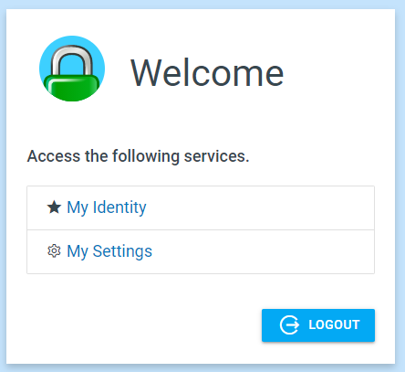

# User Interface Features

## Auto-Redirect URL

Consider the following configuration snippet. When the JWT plugin detects
unauthenticated user, it forwards the user to `https://auth.example.com`.
The `redirect_url` in URL query creates `AUTH_PORTAL_REDIRECT_URL` cookie
in the users session. Upon successful authentication, the portal
clears the cookie and redirects the user to the path specified in
`AUTH_PORTAL_REDIRECT_URL` cookie.

```
https://chat.example.com {
  authorize {
    set auth url https://auth.example.com/auth?redirect_url=https://chat.example.com
  }
}
```

## Custom CSS Styles

The following Caddyfile directive adds a custom CSS stylesheet to the
plugin's pages. The stylesheet is available under `auth/assets/css/custom.css`

```
      ui {
        ...
        custom_css_path path/to/styles.css
        ...
      }
```

## Custom Javascript

The following Caddyfile directive adds a custom javascript file to the
plugin's pages. The script is available under `auth/assets/js/custom.js`

```
      ui {
        ...
        custom_js_path path/to/script.js
        ...
      }
```

This directive is usefule for adding Google Analytics or other
minor javascript code.

## Portal Links

The following Caddyfile directive sets links that a user would see
upon a successful login:

```bash
      ui {
        ...
        links {
          "Prometheus" /prometheus
          "Alertmanager" /alertmanager
          "My App" /myapp
        }
        ...
      }
```

The link can be opened in a new tab or window via `target_blank` argument:

```
          "My App" /myapp target_blank
```

The link can be disabled with `disabled` argument:

```
          "My App" /myapp disabled
```

The link can have an icon associated with it via `icon` argument:

```
          "My App" /myapp icon "las la-cog"
```

The icon is the reference to [Line Awesome](https://icons8.com/line-awesome) by Icon8.



## Custom Header

The following Caddyfile directive injects the code found in `path/to/head.html`
to `<head>` section of the portal's pages:

```bash
      ui {
        ...
        custom_html_header_path path/to/head.html
        ...
      }
```


## Static Assets of Any Type

The following Caddyfile directive is capable of loading and serving any type of static
asset, e.g. `js`, `css`, etc.

```bash
      ui {
        ...
        static_asset "assets/css/app.css" "text/css" /path/to/app/styles.css
        ...
      }
```

The above configuration would cause the plugin to read `/path/to/app/styles.css`
and begin serving it with content type of `text/css`  at
`AUTH_PORTAL/assets/css/app.css`, e.g. `https://localhost:8443/auth/assets/css/app.css`.
