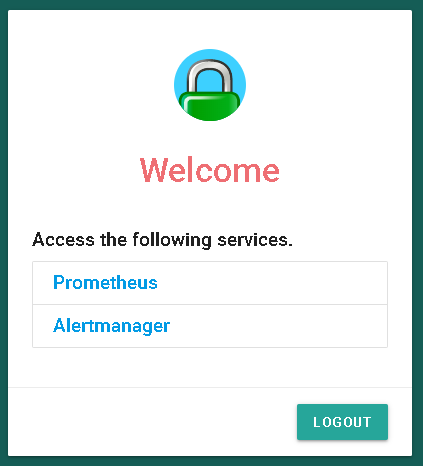
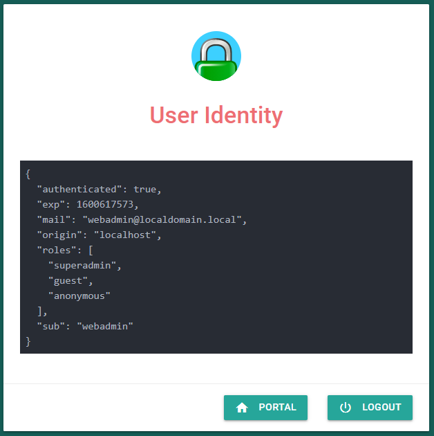
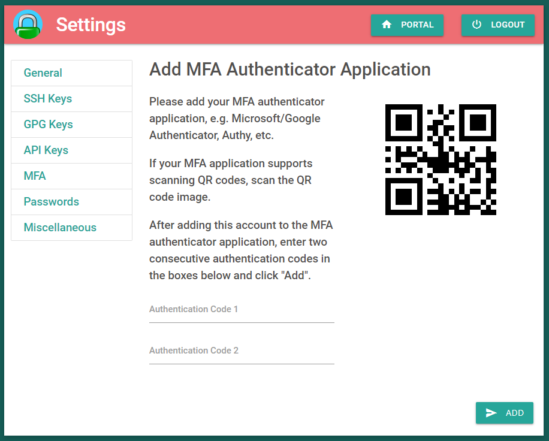
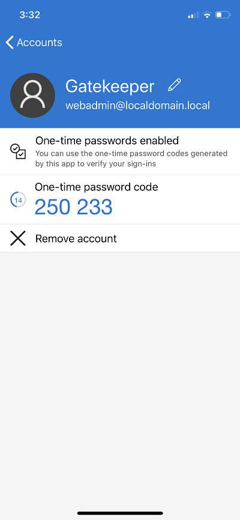

# Authentication Portal




## User Identity

The following screenshot is from `/auth/whoami` endpoint:



## User Settings

The following screenshot is from `/auth/settings/` endpoint:


## Multi-Factor Authentication MFA

### Enabling MFA

MFA can be enabled by adding `require mfa` directive inside `transform user` directive:

```
    authp {
      backend local /etc/gatekeeper/auth/local/users_db.json local
      transform user {
        match origin local
        require mfa
      }
    }
```

Currently, the MFA requirement can be applied only to `local` backend type.

### Add MFA Authenticator Application

The following screenshot is from `/auth/settings/mfa/add/app` endpoint:



The QR Code displayed on the page complies [Key Uri Format](https://github.com/google/google-authenticator/wiki/Key-Uri-Format).

In your MFA application, e.g. Microsoft Authenticator, follow these steps to
onboard your web account.

| <!-- -->    | <!-- -->    | <!-- -->    |
|-------------|-------------|-------------|
|  |  |  |

## Theming

The theming of the portal works as follows.

It starts with a concept of `theme`. By default, the portal uses `basic` theme.
There is no need to defind it in Caddyfile.

```
localhost {
  route /auth* {
    authp {
      ui {
        theme basic
      }
```

Each theme must have a set of default pages:

* `generic`
* `login`
* `portal`
* `register`
* `whoami`
* `settings`
* `sandbox`

The plain text templates are being stored in `assets/templates/<THEME>/<PAGE>.template`.

```
assets/templates/basic/generic.template
assets/templates/basic/login.template
assets/templates/basic/portal.template
assets/templates/basic/register.template
assets/templates/basic/whoami.template
assets/templates/basic/settings.template
assets/templates/basic/sandbox.template
```

These templates are the parts of `pkg/ui/pages.go`. They are compiled in the
portal's binary. That is, there is no need to store them on the disk.

Next, if a user wants to use a different template, then it could be passed via
Caddyfile directives. Specifically, use `template <PAGE_NAME>` directive to point
to a file on disk.

```
localhost {
  route /auth* {
    authp {
      ui {
        theme basic
        template login "/etc/gatekeeper/ui/login.template"
      }
```

TODO: Review [Refactoring UI Feed](https://twitter.com/i/events/994601867987619840)
and [Refactoring UI Website](https://refactoringui.com/).
