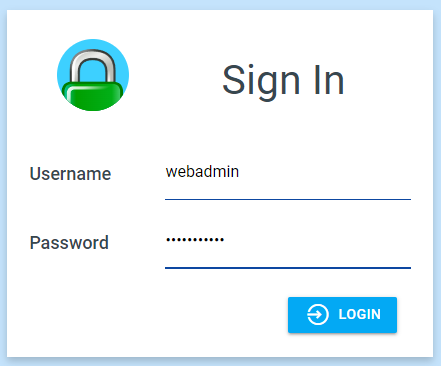
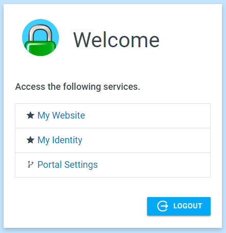
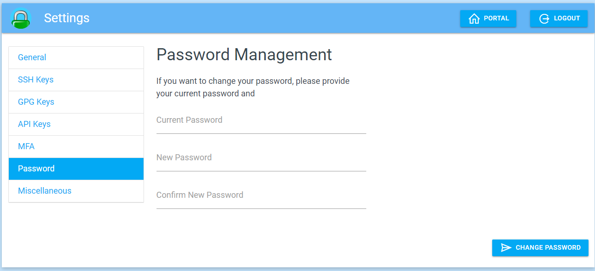

# Password Management

## Manually

An administrator may change the password directly in `users.json` file.

First, download `bcrypt-cli`:

```bash
go get -u github.com/bitnami/bcrypt-cli
```

If you are using a newer version of Go use the following command to download `bcrypt-cli`:
```bash
go install github.com/bitnami/bcrypt-cli@v1.0.2
```

Then, use it to generate a new password:

```bash
$ echo -n "password123" | bcrypt-cli -c 10
$2a$10$OVnOaHDkcOXfbUZPFh5qt.yJqUt6pl9uJaqEMxxM.vS5fY/cZNmsq
```

Finally, replace the newly generated password in the user database file.

## Settings Page

Any non-guest user could reset a password by browsing to `/settings`
endpoint.

First, login to the portal.



Next, browse to "Settings" page.



Finally, navigate to "Password" and change it.


