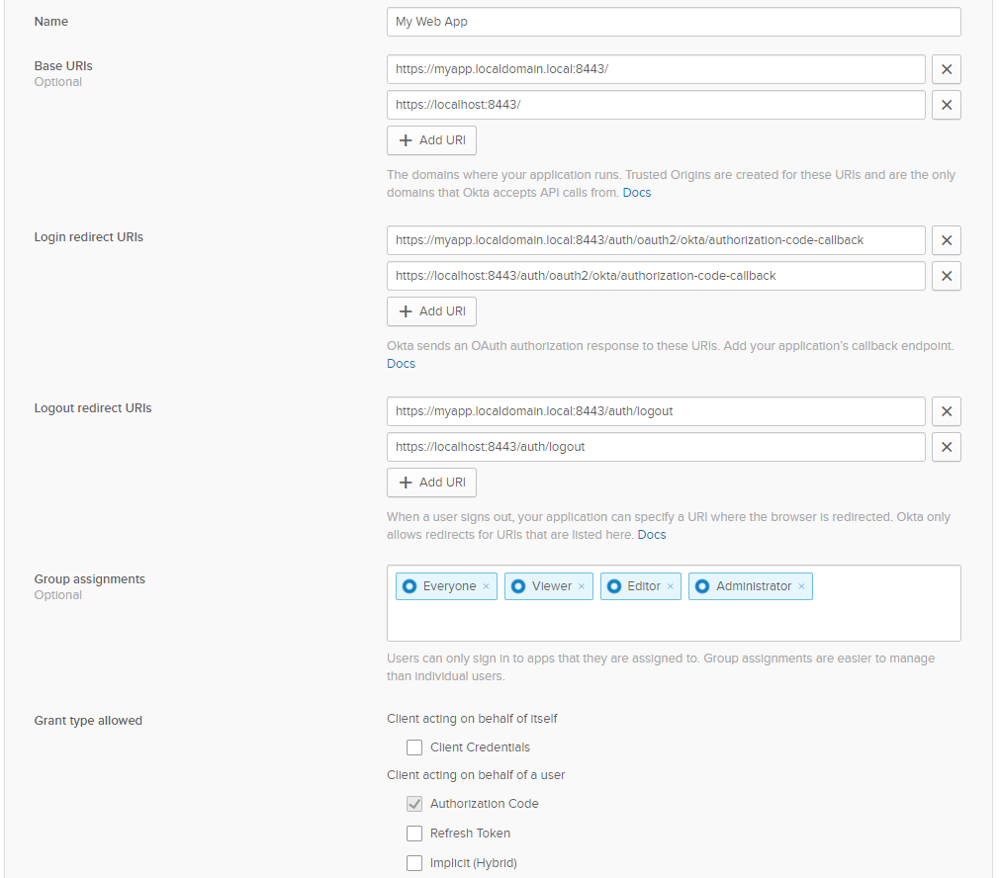
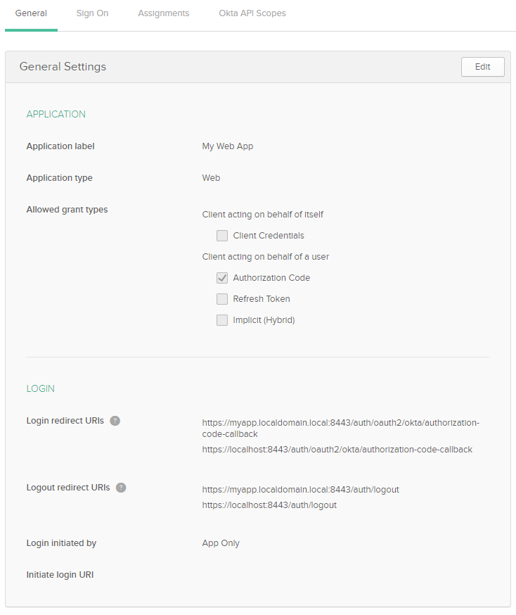
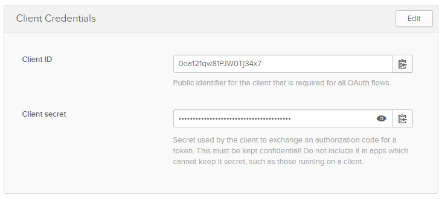
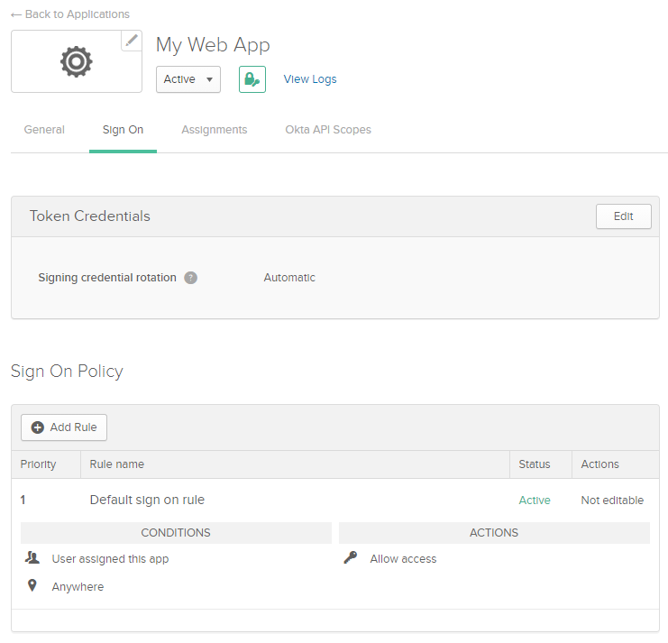
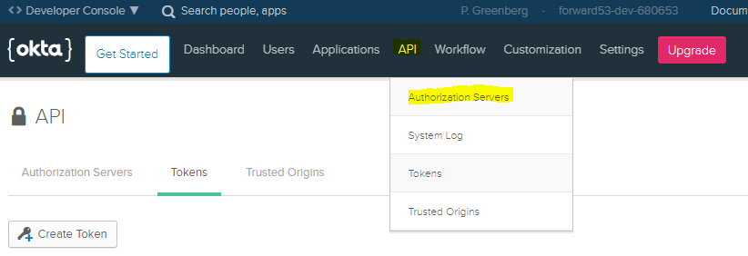
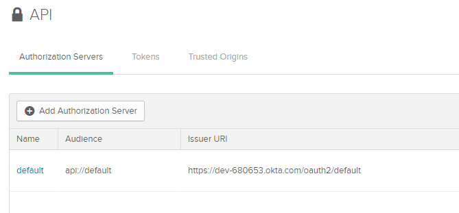

# Okta

Create an "Application," by browsing to "Applications" and clicking
"Add Application" button.

For a website, the choice is "Web".


Provided your application is running on localhost port 8443, provide the following
information:

Base URI entries:
* `https://myapp.localdomain.local:8443/`
* `https://localhost:8443/`

Login redirect URIs:
* `https://myapp.localdomain.local:8443/auth/oauth2/okta/authorization-code-callback`
* `https://localhost:8443/auth/oauth2/okta/authorization-code-callback`

Logout redirect URIs:
* `https://myapp.localdomain.local:8443/auth/logout`
* `https://localhost:8443/auth/logout`

Group Assignments:
* Everyone
* Viewer
* Editor
* Administrator

Grant type allowed:
* Client acting on behalf of itself
  - Client Credentials: No
* Client acting on behalf of a user
  - Authorization Code: Yes
  - Refresh Token: No
  - Implicit (Hybrid): No




Review the newly created application.



Store the credentials securely.



Review default Sign On Policy.



By default, the default Authorization Server has no `groups` scope.

Therefore, browse to "API", "Authorization Servers" and select "default".





Next, browse to "Scopes" and click "Add Scope".

Fill out the "Add Scope" form:
* Name: `groups`
* Description: `This allows the app to view your group memberships.`
* Check "Set as a default scope"
* Check "Include in public metadata"


Next, browse to "Claims" and click "Add Claim".

Fill out the "Add Claim" form:
* Name: `groups`
* Include in token type: "ID Token", "Always"
* Value type: Groups
* Filter: Matches `.*` regex
* Include in: The "groups" scope


Next, review [Okta OpenID Connect and OAuth 2.0 API - Get Started](https://developer.okta.com/docs/reference/api/oidc/#get-started).

The following [`Caddyfile`](https://github.com/greenpau/caddy-auth-docs/blob/main/assets/conf/oauth/okta/Caddyfile)
allows Okta-based authentication.

Provided the Okta domain is `dev-680653.okta.com`, the authorization server is
`default`, and Client ID is `0oa121qw81PJW0Tj34x7`, check OpenID configuration:

```bash
curl -X GET "https://dev-680653.okta.com/oauth2/default/.well-known/openid-configuration?client_id=0oa121qw81PJW0Tj34x7" | jq
```

By default, the plugin logs public keys from `keys` endpoint.

