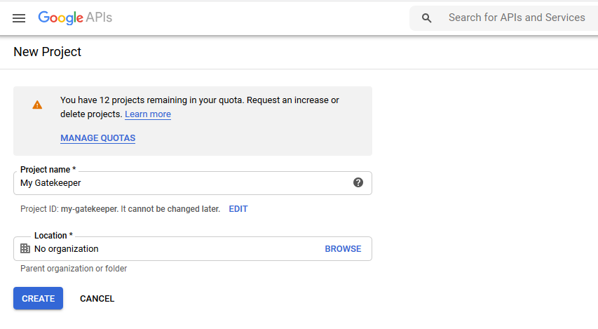
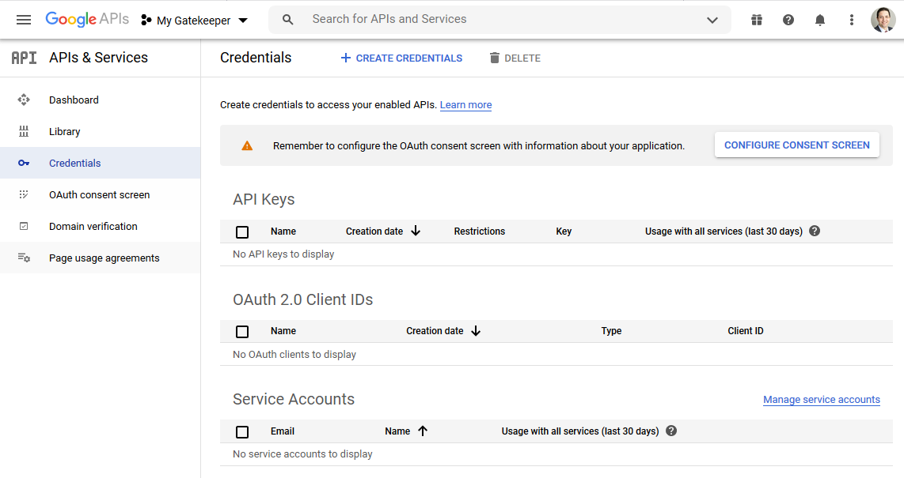
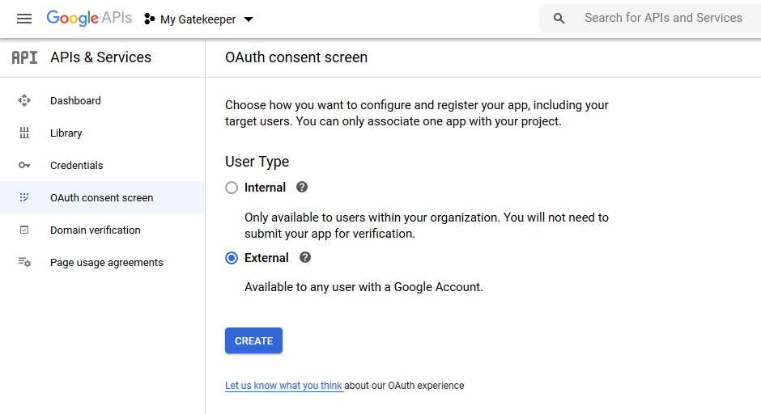
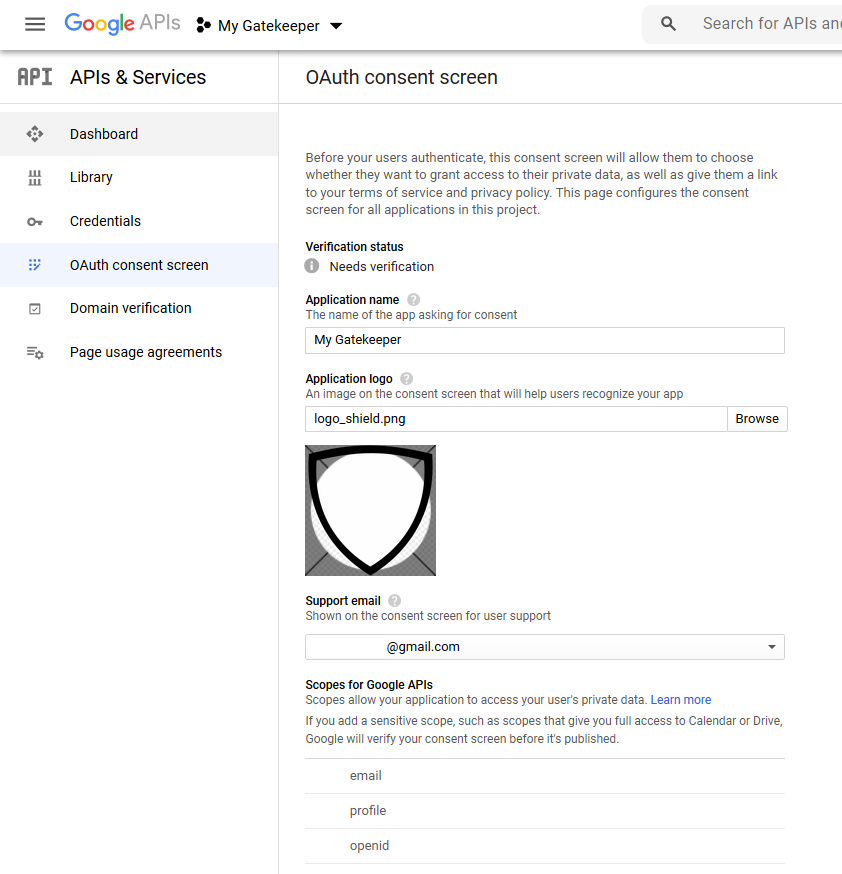
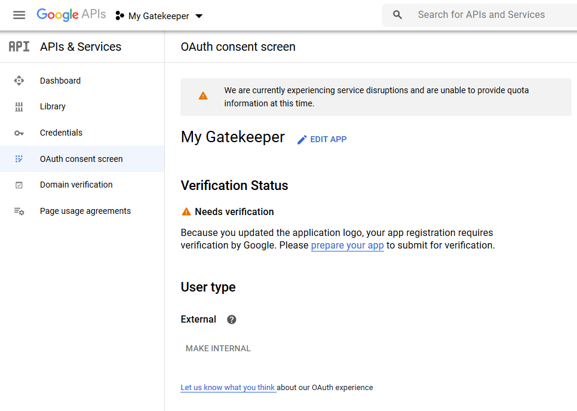
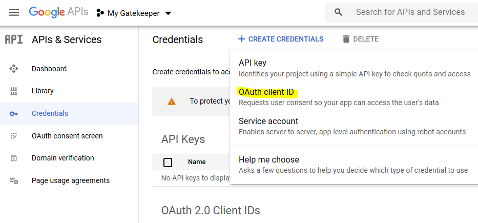
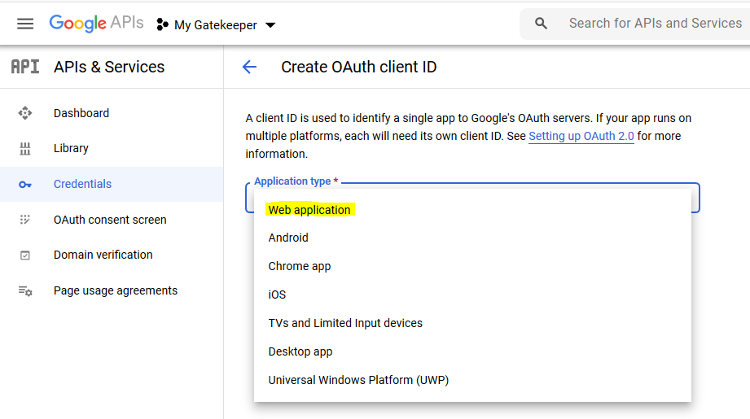
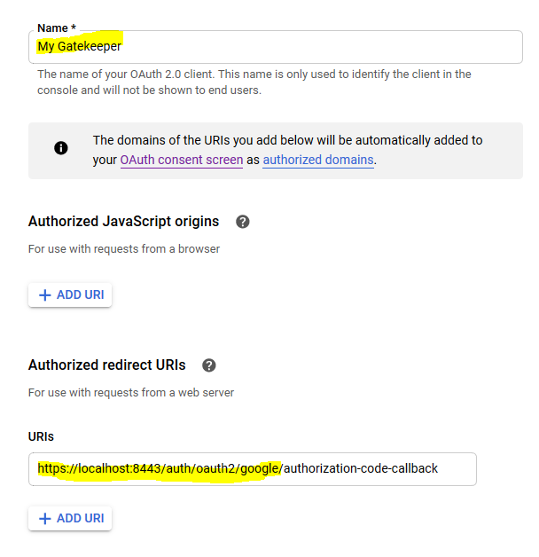
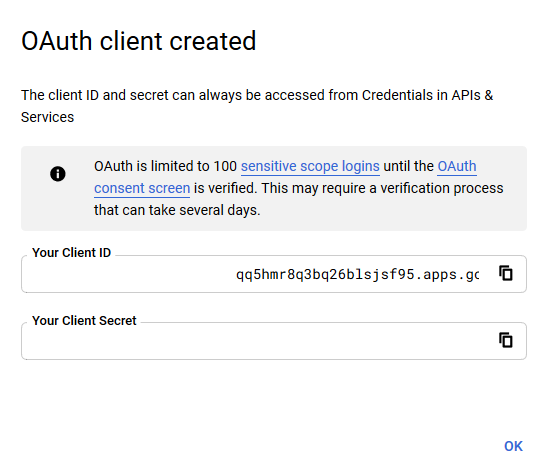

# Google Identity Platform

References:
* [Google Identity Platform - Using OAuth 2.0 for Web Server Applications](https://developers.google.com/identity/protocols/oauth2/web-server#httprest_2)
* [Google Identity Platform - Identity Platform - OpenID Connect](https://developers.google.com/identity/protocols/oauth2/openid-connect)

The Caddyfile snippet for Google OAuth 2.0 OpenID backend is as follows.

The following [`Caddyfile`](https://github.com/greenpau/caddy-auth-docs/blob/main/assets/conf/oauth/google/Caddyfile)
allows Google-based authentication.

First, create new application, e.g. "My Gatekeeper".

After the creation of the app, you will land on Credentials page.

Click "Configure Consent Screen" and select an appropriate option, e.g. "External".

Next, provide the name for the application, e.g. "My Gatekeeper" and select appropriate support email.

After configuring the consent screen you will see the following.

Next, browse to "Credentials" and click "Create Credentials". Then, choose "OAuth client ID":

First, choose the type of credentials:

Next, provide Redirect URL:

Login redirect URIs:
* `https://localhost:8443/auth/oauth2/google/authorization-code-callback`

Finally, you will get a confirmation. Store the Client ID and Client Secret securely.

