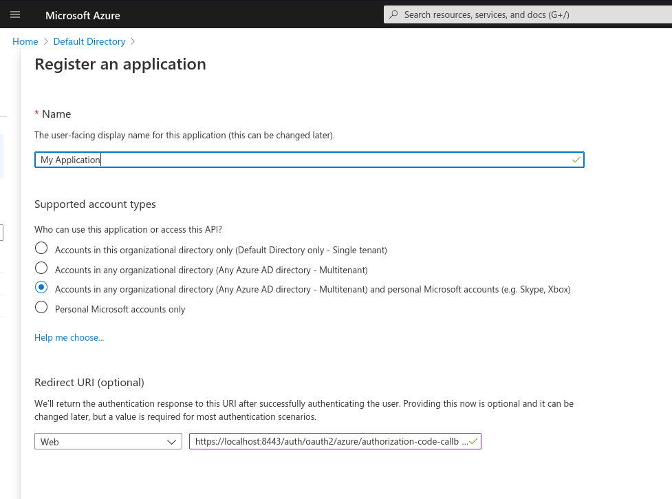
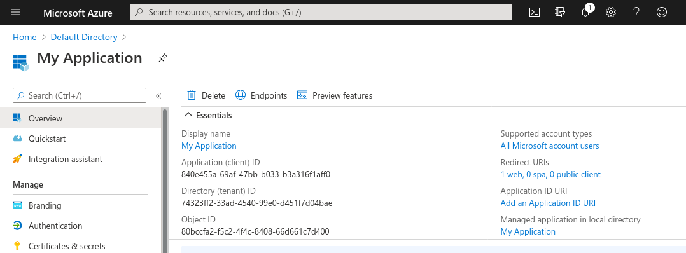
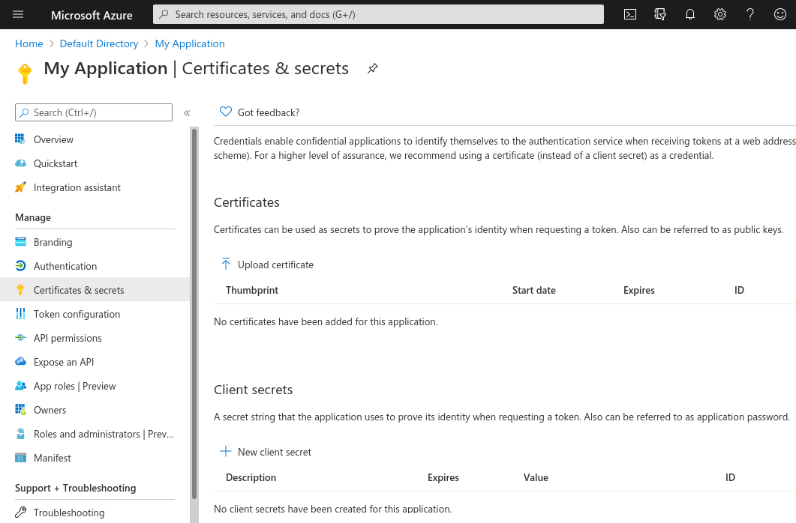

# Microsoft

To register an OAuth2 application for login with Microsoft accounts
(either personal, i.e. Live or Xbox accounts, or enterprise,
i.e. AzureAD accounts), you can follow the documentation at
`https://docs.microsoft.com/en-us/advertising/guides/authentication-oauth-identity-platform`.

In summary, you open the `Azure Active Directory` section on
`https://portal.azure.com` and navigate to `App registrations`.


There you select `New registration` and enter your application's name,
your choice of supported account types and the the redirect URI

```
https://localhost:8443/auth/oauth2/azure/authorization-code-callback
```



As soon as the application registration was successfully created, you
can note down its `Application (client) ID` listed in the `Essentials`
section at the top.



Finally, you need to generate a client secret to authenticate
`caddy-auth-portal`. In the sidebar, navigate to `Certificates and
secrets` and click on `New client secret`.



After the secret was successfully created, copy its value (you won't
be able to retrieve it again!).


You now have all the necessary information to use the backend in your
`Caddyfile`:

```
        azure_oauth2_backend {
          method oauth2
          realm azure
          provider azure
          client_id 840e455a-69af-47bb-b033-b3a316f1aff0
          client_secret MnE~D8G5Dh_gWRq_jc3uJ8Q8wjBqBv.N3r
          scopes openid email profile
        }
```

If you chose `Accounts in this organizational directory only` as the
account type, you additionally need to add the line

```
          tenant_id <your tenant ID>
```

where the `tenant ID` can either be the actual Directory ID, or its
friendly name `<something>.onmicrosoft.com`.

