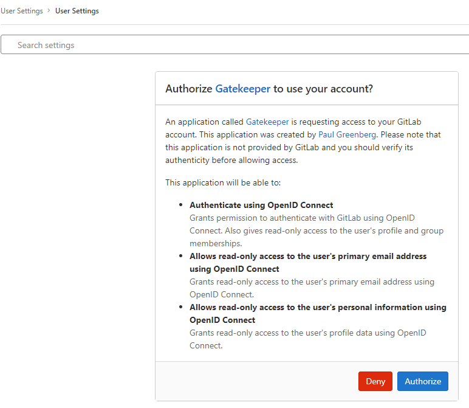
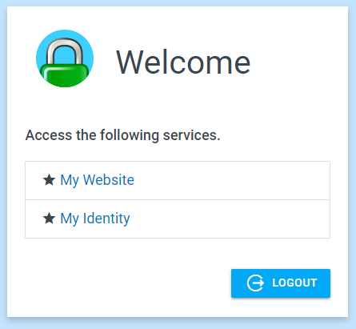

# Gitlab

Whether you are using gitlab.com or hosting your own Gitlab instance
(e.g. at `gitlab.contoso.com`), create a new app by browsing to
one of the following URLs:

* `https://gitlab.contoso.com/-/profile/applications`
* `https://gitlab.com/-/profile/applications`


The following [`Caddyfile`](https://github.com/greenpau/caddy-auth-docs/blob/main/assets/conf/oauth/gitlab/Caddyfile)
allows Gitlab-based authentication.

By default, Gitlab groups are not included into the token, unless
the `user_group_filters` directive is being user in the configuration.

The following directives instruct the portal to add the groups having
`barfoo` in their name and the groups whose names start with the `a`.

```
          user_group_filters barfoo
          user_group_filters ^a
```

In this case, the groups making it to the JWT token are:

```
    "gitlab.contoso.com/barfoo",
    "gitlab.contoso.com/a-private-group/a-subgroup"
```

When a user browses to the app and clicks Gitlab link, the user is being redirected to
Gitlab instance. 


The user should click Authorize to continue.



Once logged in, the user may browse to "My Identity".



The relevant Gitlab data became a part of the JWT token issued by the portal.


